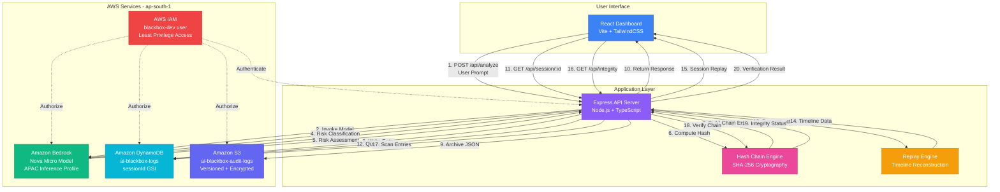

# AI Blackbox: Forensic Accountability System for AI Interactions

## System Overview

AI Blackbox is a forensic audit and accountability system designed to provide tamper-evident logging and complete traceability for AI interactions. As AI systems become increasingly integrated into critical decision-making processes, the ability to audit, verify, and replay AI interactions becomes essential for compliance, security, and accountability.

The system captures every AI prompt, model response, and risk classification in a cryptographically secured audit trail. Using SHA-256 hash chaining, each audit entry is cryptographically linked to the previous entry, creating an immutable chain that makes any tampering immediately detectable. This enables organizations to:

- **Maintain compliance** with regulatory requirements for AI system auditing
- **Investigate incidents** by replaying complete AI interaction sessions
- **Detect tampering** through cryptographic verification of audit chains
- **Assess risk** by classifying AI outputs in real-time
- **Ensure accountability** with complete forensic trails of AI decision-making

## Architecture Overview

AI Blackbox is built as a fully AWS-native application leveraging managed services for scalability, reliability, and security. The architecture follows a three-tier design:

1. **Presentation Layer**: React-based dashboard with real-time monitoring and forensic replay capabilities
2. **Application Layer**: Node.js/Express API server handling AI inference, audit logging, and chain verification
3. **Data Layer**: DynamoDB for structured queries, S3 for immutable archives, and Amazon Bedrock for AI inference

The system operates in the AWS ap-south-1 region and uses the following AWS services:

- **Amazon Bedrock** (Nova Micro model via APAC inference profile) for AI inference and risk classification
- **Amazon DynamoDB** for fast, structured audit log storage with session-based indexing
- **Amazon S3** for encrypted, versioned, long-term audit archives
- **AWS IAM** for access control and service authentication

All components communicate through secure APIs, and data is encrypted both in transit and at rest.

## Data Flow

The complete data flow through the AI Blackbox system follows these steps:

### 1. User Interaction
A user submits a prompt through the React dashboard's Analyze page. The prompt includes:
- User input text
- Optional session ID (or auto-generated UUID)

### 2. API Request
The dashboard sends an HTTP POST request to `/api/analyze` on the Express API server with the prompt payload.

### 3. Prompt Logging
The API server creates the first audit entry:
- Generates a unique entry ID
- Records timestamp
- Associates with session ID
- Retrieves the previous hash from the session's last entry (or '0' for first entry)
- Computes SHA-256 hash including the previous hash
- Stores entry in DynamoDB
- Archives entry JSON to S3

### 4. AI Inference
The API server invokes Amazon Bedrock:
- Uses the `apac.amazon.nova-micro-v1:0` inference profile
- Sends the prompt to the Nova Micro model
- Receives the AI-generated response
- Captures token usage metrics

### 5. Response Logging
The API server creates a second audit entry for the response:
- Links to the prompt entry via hash chain
- Stores the complete AI response
- Records model identifier and token count
- Computes and stores hash
- Persists to DynamoDB and S3

### 6. Risk Classification
The API server performs a second Bedrock inference call:
- Sends both the original prompt and AI response for analysis
- Requests risk classification (LOW/MEDIUM/HIGH)
- Receives risk level and reasoning

### 7. Risk Assessment Logging
The API server creates a third audit entry:
- Records risk level and reasoning
- Links to response entry via hash chain
- Completes the interaction audit trail
- Stores in DynamoDB and S3

### 8. Response Return
The API server returns to the dashboard:
- AI response text
- Risk classification
- Session ID
- Audit entry details including hashes

### 9. Dashboard Display
The React dashboard displays:
- AI response with formatting
- Risk badge (color-coded: green/yellow/red)
- Session and audit entry identifiers
- Hash values for verification

## AWS Service Roles

### Amazon Bedrock

Amazon Bedrock serves as the AI inference engine for the system, providing two critical functions:

**Primary AI Inference**: The Nova Micro model generates responses to user prompts. The model is accessed through the APAC inference profile (`apac.amazon.nova-micro-v1:0`) which provides optimized routing for the ap-south-1 region. The system uses the InvokeModel API with JSON payloads containing message arrays and inference configuration.

**Risk Classification**: A second Bedrock inference call analyzes the prompt-response pair to classify content risk. The system prompts the model to evaluate content for harmful, dangerous, illegal, or unethical material, returning a structured risk assessment with level (LOW/MEDIUM/HIGH) and reasoning.

The use of Bedrock eliminates the need for model hosting infrastructure and provides automatic scaling, while the Nova Micro model offers cost-effective inference suitable for audit logging workloads.

### Amazon DynamoDB

DynamoDB serves as the primary structured data store for audit entries, providing:

**Fast Writes**: Each audit entry is written to DynamoDB immediately after hash computation, ensuring minimal latency in the audit pipeline.

**Session-Based Queries**: A Global Secondary Index (GSI) on `sessionId` with a sort key on `timestamp` enables efficient retrieval of all entries for a specific session, ordered chronologically. This supports the forensic replay feature.

**Structured Access**: The document model stores complete audit entries including metadata, data payloads, and cryptographic hashes, enabling complex queries for integrity verification and session analysis.

**Scalability**: DynamoDB's automatic scaling handles variable workloads without manual intervention, supporting both low-volume testing and high-volume production scenarios.

The table schema uses `id` (UUID) as the partition key for even distribution and includes all audit entry fields as attributes.

### Amazon S3

S3 provides immutable, long-term archival storage for audit logs:

**Versioning**: S3 versioning is enabled on the `ai-blackbox-audit-logs` bucket, preserving all versions of audit entries. This provides an additional layer of tamper detection—any modification creates a new version rather than overwriting the original.

**Encryption**: Server-side encryption (SSE-S3) with AES-256 protects data at rest. All audit entries are encrypted automatically upon upload.

**Object Organization**: Audit entries are organized by session ID in the key structure: `{sessionId}/{entryId}.json`. This enables efficient retrieval of all entries for a session and supports lifecycle policies.

**Durability**: S3's 99.999999999% (11 9's) durability ensures audit logs are preserved even in the event of infrastructure failures.

**Compliance**: S3's immutability features (when combined with Object Lock in production) can support regulatory compliance requirements for audit log retention.

### AWS IAM

IAM controls access to all AWS resources:

**Service Authentication**: The application uses IAM credentials (access key and secret key) to authenticate API calls to Bedrock, DynamoDB, and S3. In production, this would be replaced with IAM roles for EC2/ECS/Lambda.

**Least Privilege**: The IAM user `blackbox-dev` has permissions scoped to only the required actions:
- `bedrock:InvokeModel` for AI inference
- `dynamodb:PutItem`, `dynamodb:Query`, `dynamodb:Scan` for audit storage
- `s3:PutObject`, `s3:GetObject` for archive storage

**Resource Restrictions**: IAM policies restrict access to specific resources (the DynamoDB table and S3 bucket) preventing lateral movement or unauthorized access to other AWS resources.

**Audit Trail**: AWS CloudTrail (when enabled) logs all IAM-authenticated API calls, providing an additional audit layer for system access.

## Cryptographic Audit Chain

The cryptographic audit chain is the core security mechanism that makes AI Blackbox tamper-evident. It operates on the principle of hash chaining, where each audit entry includes a cryptographic hash of the previous entry.

### Hash Chain Mechanics

**Entry Structure**: Each audit entry contains:
```typescript
{
  id: string,              // Unique entry identifier
  timestamp: number,       // Unix timestamp
  sessionId: string,       // Session identifier
  eventType: string,       // 'prompt' | 'response' | 'risk_assessment'
  data: object,           // Event-specific payload
  previousHash: string,   // Hash of previous entry in session
  hash: string           // SHA-256 hash of this entry
}
```

**Hash Computation**: The hash is computed using SHA-256 over a canonical JSON representation of the entry (excluding the hash field itself):

```
hash = SHA256(JSON.stringify({
  id,
  timestamp,
  sessionId,
  eventType,
  data: sortedKeys(data),  // Keys sorted for consistency
  previousHash
}))
```

**Chain Linkage**: Each entry's `previousHash` field contains the `hash` value from the previous entry in the same session. The first entry in a session has `previousHash = '0'`, establishing the chain genesis.

### Tamper Detection

The hash chain provides tamper detection through verification:

**Forward Verification**: For each entry, recompute its hash and compare to the stored hash. Any modification to the entry data will produce a different hash, immediately revealing tampering.

**Backward Verification**: Verify that each entry's `previousHash` matches the previous entry's `hash`. Any insertion, deletion, or reordering of entries breaks the chain.

**Session Integrity**: The `/api/integrity` endpoint performs complete chain verification for each session, returning detailed error messages for any inconsistencies.

### Security Properties

**Immutability**: Once an entry is written with its hash, any modification is detectable. An attacker would need to recompute hashes for all subsequent entries in the chain.

**Non-Repudiation**: The hash chain proves that entries were created in a specific order at specific times. Entries cannot be backdated or reordered without detection.

**Completeness**: Missing entries are detected because the chain will have a gap where `previousHash` doesn't match any existing entry's hash.

**Cryptographic Strength**: SHA-256 provides 256-bit security, making hash collisions computationally infeasible with current technology.

## Forensic Replay Engine

The forensic replay engine reconstructs complete AI interaction sessions for incident investigation, compliance auditing, and security analysis.

### Timeline Reconstruction

The replay engine (`src/replay/replayEngine.ts`) processes a session's audit entries to build a comprehensive timeline:

**Event Sequencing**: Entries are sorted by timestamp to establish the exact order of events within a session.

**Duration Calculation**: The time delta between consecutive events is computed, revealing:
- User think time between prompts
- AI inference latency
- Risk assessment processing time

**Event Correlation**: The engine correlates related entries (prompt → response → risk assessment) into logical interaction units.

### Risk Escalation Detection

The replay engine analyzes risk levels across a session to detect escalation patterns:

**Risk Tracking**: Each risk assessment entry's level is tracked chronologically.

**Escalation Identification**: When risk level increases (LOW → MEDIUM → HIGH), the engine records:
- Source risk level
- Target risk level
- Timestamp of escalation
- Associated prompt and response

**Pattern Analysis**: Multiple escalations in a session may indicate:
- Adversarial prompt engineering attempts
- Gradual manipulation of AI behavior
- Unintentional drift into sensitive topics

### Session Summary

The replay engine generates a comprehensive session summary:

```typescript
{
  sessionId: string,
  totalDuration: number,           // Total session time in ms
  totalEvents: number,             // Count of all audit entries
  promptCount: number,             // Number of user prompts
  responseCount: number,           // Number of AI responses
  riskAssessmentCount: number,     // Number of risk evaluations
  finalRiskLevel: string,          // Last assessed risk level
  averageEventInterval: number,    // Mean time between events
  riskEscalation: {
    detected: boolean,
    escalations: Array<{
      from: string,
      to: string,
      timestamp: number
    }>
  }
}
```

### Investigation Use Cases

**Incident Response**: When an AI system produces problematic output, investigators can replay the entire session to understand:
- What prompts led to the output
- How the conversation evolved
- Whether risk escalation occurred
- The complete context of the interaction

**Compliance Auditing**: Auditors can verify:
- All AI interactions were logged
- Risk assessments were performed
- Appropriate responses were given to sensitive queries
- No gaps exist in the audit trail

**Security Analysis**: Security teams can identify:
- Prompt injection attempts
- Adversarial behavior patterns
- Unusual interaction sequences
- Potential system abuse

## Mermaid Architecture Diagram



## Security Considerations

### Encrypted Storage

**Data at Rest**: All audit entries stored in S3 are encrypted using AES-256 server-side encryption. DynamoDB encryption at rest can be enabled for additional protection of structured data.

**Data in Transit**: All communication between components uses HTTPS/TLS:
- Dashboard to API server: HTTPS
- API server to AWS services: TLS 1.2+
- AWS service-to-service: AWS PrivateLink (internal AWS network)

**Key Management**: Encryption keys are managed by AWS, eliminating the operational burden of key rotation and storage. For enhanced security, AWS KMS customer-managed keys can be used.

### IAM Access Control

**Principle of Least Privilege**: The IAM user has only the minimum permissions required:
- No administrative access
- No access to other AWS accounts or regions
- Scoped to specific resources (table, bucket, model)

**Credential Management**: Access keys are stored securely and never committed to version control. In production, IAM roles for compute resources (EC2, ECS, Lambda) eliminate the need for long-lived credentials.

**Service Control Policies**: Additional restrictions can be applied at the AWS Organizations level to prevent privilege escalation or unauthorized service access.

**Multi-Factor Authentication**: MFA should be enabled for all IAM users with console access to prevent credential compromise.

### Tamper Detection

**Cryptographic Verification**: The SHA-256 hash chain provides mathematical proof of data integrity. Any modification to historical entries is immediately detectable through chain verification.

**Dual Storage**: Storing entries in both DynamoDB and S3 provides redundancy for tamper detection. Discrepancies between the two stores indicate potential tampering.

**Versioning**: S3 versioning preserves all historical versions of audit entries. Even if an attacker modifies an entry, the original version remains accessible.

**Immutability**: S3 Object Lock (when enabled) can enforce write-once-read-many (WORM) semantics, making audit logs truly immutable for compliance requirements.

### Audit Reliability

**High Availability**: DynamoDB and S3 are multi-AZ services, providing 99.99% availability SLA. Audit logging continues even during infrastructure failures.

**Durability**: S3's 11 9's durability ensures audit logs are not lost. DynamoDB's automatic backups provide point-in-time recovery.

**Consistency**: DynamoDB provides strong consistency for reads, ensuring integrity verification always operates on the latest data.

**Monitoring**: CloudWatch metrics and alarms can detect:
- Failed audit writes
- Integrity verification failures
- Unusual access patterns
- Service errors

**Compliance**: The architecture supports compliance with:
- SOC 2 Type II (audit logging requirements)
- GDPR (data retention and deletion)
- HIPAA (audit trail requirements)
- PCI DSS (logging and monitoring)

### Threat Model

**Insider Threats**: Hash chain verification detects unauthorized modifications by insiders with database access. S3 versioning provides an audit trail of all changes.

**External Attacks**: IAM access controls and encryption prevent unauthorized access to audit data. Even if an attacker gains access, the hash chain reveals tampering.

**Replay Attacks**: Timestamps in audit entries prevent replay attacks. Each entry is unique and time-bound.

**Denial of Service**: AWS managed services provide DDoS protection and automatic scaling to maintain availability under attack.

**Data Exfiltration**: Encryption at rest and in transit protects audit data confidentiality. IAM policies restrict data access to authorized services only.

---

## Conclusion

AI Blackbox demonstrates a production-ready architecture for forensic AI accountability using AWS managed services. The combination of cryptographic hash chaining, dual storage (DynamoDB + S3), and Amazon Bedrock integration provides a robust foundation for auditing AI systems in regulated industries.

The architecture is designed for:
- **Scalability**: Serverless components scale automatically with demand
- **Reliability**: Multi-AZ services provide high availability
- **Security**: Encryption, IAM, and hash chains ensure data integrity
- **Compliance**: Immutable audit trails support regulatory requirements
- **Observability**: Complete forensic replay enables incident investigation

This system can be extended with additional features such as:
- Real-time alerting on risk escalation
- Machine learning-based anomaly detection
- Integration with SIEM systems
- Automated compliance reporting
- Multi-region replication for disaster recovery

The AWS-native design minimizes operational overhead while maximizing security and reliability, making it suitable for production deployment in enterprise environments.
