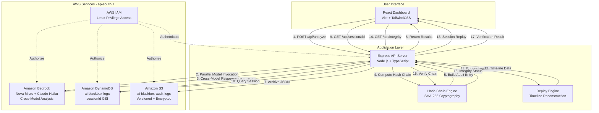

# AIdeas: AI Blackbox — A Tamper-Evident Forensic Accountability System for AI Decisions

**App Category**: Workplace Efficiency

**Author**: AI Blackbox Team

**Competition**: AWS 10,000 AIdeas

---

## App Category: Workplace Efficiency

AI Blackbox fits squarely in the Workplace Efficiency category because it solves a critical operational challenge: maintaining accountability and trust in AI-assisted decision-making. As organizations increasingly rely on AI systems for customer service, content moderation, compliance reviews, and business intelligence, they need robust mechanisms to audit AI behavior, investigate incidents, and ensure regulatory compliance.

Traditional logging systems capture what happened, but they don't provide cryptographic proof that logs haven't been tampered with. AI Blackbox transforms standard audit logging into a forensic-grade accountability system using cryptographic hash chains, enabling organizations to:

- **Reduce incident investigation time** by providing complete, verifiable session replays
- **Streamline compliance audits** with tamper-evident audit trails
- **Improve AI safety** through cross-model comparison and risk classification
- **Increase operational confidence** with cryptographic integrity verification

By making AI systems auditable and accountable, AI Blackbox helps organizations work more efficiently with AI while maintaining the trust and transparency required for regulated industries.


## My Vision

The inspiration for AI Blackbox came from a simple question: "How do we know what an AI system actually said?"

As AI systems become embedded in critical workflows—from healthcare diagnostics to financial advice to legal research—the stakes of AI decisions grow higher. Yet most organizations treat AI interactions as ephemeral: prompts go in, responses come out, and the only record is whatever the application developer chose to log. When something goes wrong, investigators face a black box with no reliable way to reconstruct what happened or verify that logs haven't been altered.

I envisioned a system that would bring the same level of forensic rigor to AI interactions that we expect from financial transactions or medical records. Every prompt, every response, every risk assessment should be captured in a tamper-evident audit trail. If an AI system makes a problematic recommendation, investigators should be able to replay the entire session, verify the integrity of the logs, and understand exactly what happened—with cryptographic proof that the evidence hasn't been manipulated.

The vision extends beyond simple logging. By evaluating prompts across multiple foundation models simultaneously, AI Blackbox reveals how different models respond to the same input. This cross-model analysis exposes safety blind spots, identifies model-specific biases, and provides multiple perspectives on content risk. It transforms AI accountability from a compliance checkbox into a proactive safety mechanism.

AI Blackbox is designed for a future where AI systems are not just powerful, but trustworthy—where every AI decision can be audited, every interaction can be verified, and organizations can confidently deploy AI knowing they have complete forensic accountability.


## Why This Matters

### The Growing AI Governance Challenge

Organizations worldwide are deploying AI systems at an unprecedented pace. According to recent industry reports, over 80% of enterprises now use AI in some capacity, with applications ranging from customer service chatbots to automated decision-making systems. However, this rapid adoption has outpaced the development of governance frameworks, creating significant risks:

**Regulatory Pressure**: Governments are introducing AI-specific regulations. The EU AI Act, for example, requires high-risk AI systems to maintain detailed logs of their operations. Similar regulations are emerging in the US, UK, and Asia-Pacific regions. Organizations without robust AI audit trails face potential fines and legal liability.

**Incident Investigation**: When AI systems produce problematic outputs—biased recommendations, harmful content, or incorrect decisions—organizations struggle to investigate. Without complete audit trails, it's impossible to determine whether the issue was a one-time anomaly or a systemic problem. This hampers both incident response and root cause analysis.

**Trust and Transparency**: Customers, regulators, and stakeholders increasingly demand transparency in AI decision-making. Organizations need to demonstrate that their AI systems are operating as intended and that they can verify AI behavior when questions arise.

### The Tamper-Evidence Gap

Traditional logging systems have a critical weakness: logs can be modified after the fact. An administrator with database access can alter or delete entries, and without cryptographic verification, there's no way to detect tampering. This creates several problems:

- **Evidence Integrity**: In legal or regulatory proceedings, tampered logs are inadmissible as evidence
- **Insider Threats**: Malicious insiders can cover their tracks by modifying audit logs
- **Compliance Failures**: Regulations like SOC 2 and HIPAA require tamper-evident audit trails

Cryptographic hash chaining solves this problem by making every audit entry mathematically linked to the previous entry. Any modification breaks the chain, providing immediate, verifiable proof of tampering.


### The Multi-Model Safety Imperative

Different AI models have different safety characteristics. A prompt that one model handles safely might cause another to produce problematic content. By evaluating prompts across multiple models, organizations can:

- **Identify Safety Blind Spots**: Discover when models disagree on content risk
- **Validate Safety Mechanisms**: Ensure multiple models concur on high-risk content
- **Reduce False Positives**: Avoid over-blocking when only one model flags content
- **Support Human Review**: Provide multiple perspectives for borderline cases

Cross-model analysis transforms AI safety from a single point of failure into a robust, multi-perspective evaluation system.

### Real-World Impact

AI Blackbox addresses real operational needs:

**Healthcare**: When an AI diagnostic system makes a recommendation, clinicians need to verify the complete interaction history and ensure the audit trail hasn't been tampered with for medical-legal purposes.

**Financial Services**: Banks using AI for fraud detection or loan decisions must maintain tamper-evident audit trails to satisfy regulatory requirements and defend against disputes.

**Content Moderation**: Platforms using AI to moderate content need to investigate incidents where AI made incorrect decisions, requiring complete session replays with integrity verification.

**Customer Service**: Organizations using AI chatbots need to audit interactions for quality assurance, compliance, and incident investigation when customers report problems.

In each case, AI Blackbox provides the forensic accountability infrastructure that makes AI deployment trustworthy and compliant.


## How I Built This

### Architecture Overview

AI Blackbox is built as a fully AWS-native application, leveraging managed services for scalability, reliability, and security. The architecture follows a three-tier design optimized for forensic accountability:

**Presentation Layer**: A React-based dashboard built with Vite and TailwindCSS provides real-time monitoring, forensic investigation, and session replay capabilities. The interface is designed for security investigators and compliance auditors, with dedicated views for integrity verification, cross-model comparison, and incident investigation.

**Application Layer**: A Node.js/Express API server written in TypeScript handles AI inference orchestration, cryptographic hash chain computation, and audit log management. The server coordinates between Amazon Bedrock for AI inference, DynamoDB for structured storage, and S3 for archival storage.

**Data Layer**: AWS managed services provide the storage and compute infrastructure. DynamoDB offers fast, scalable structured storage with session-based indexing. S3 provides durable, encrypted archival storage with versioning. Amazon Bedrock delivers AI inference without infrastructure management.

All components operate in the AWS ap-south-1 region, using IAM for authentication and authorization.

### Frontend: React Dashboard

The dashboard provides four main interfaces:

**Dashboard View**: Real-time statistics showing total audit entries, active sessions, risk distribution (LOW/MEDIUM/HIGH), and chain integrity status. A time-series chart visualizes interaction patterns over time.

**Analyze View**: Interactive prompt submission interface with cross-model comparison. Users enter prompts and receive side-by-side responses from Amazon Nova Micro and Anthropic Claude 3 Haiku, each with independent risk assessments. The interface displays the complete audit trail including session ID, entry ID, and cryptographic hashes.

**Sessions View**: Forensic replay interface showing all sessions with detailed timelines. Users can select any session to view the complete interaction history, including prompts, responses, risk assessments, and hash chain verification. Each event shows timestamps and duration since the previous event.


**Investigation View**: Dedicated forensic analysis interface for security investigators. This view presents session data in an investigative workflow: session overview, integrity verification panel (with prominent valid/invalid status), original prompt display, cross-model analysis comparison, event timeline, audit evidence (complete hash chain), and investigation summary statistics. The interface is optimized for incident response and compliance auditing.

**Integrity View**: Chain verification interface showing per-session integrity status. The view displays overall chain validity, lists all sessions with their verification status, and provides detailed error messages for any detected tampering. Color-coded indicators (green for valid, red for invalid) provide immediate visual feedback.

The frontend is built with modern web technologies:
- **React 18** for component-based UI
- **Vite** for fast development and optimized production builds
- **TailwindCSS v4** for enterprise-grade dark theme styling
- **Recharts** for data visualization
- **Lucide React** for consistent iconography
- **Axios** for API communication

The styling follows a professional dark theme (slate-950 background) similar to security tools like Datadog and Grafana, with color-coded risk badges (green/yellow/red) and smooth transitions for an enterprise-grade user experience.

### Backend: Express API Server

The Express server provides a RESTful API with six main endpoints:

**POST /api/analyze**: Accepts a prompt and optional session ID, invokes multiple Bedrock models in parallel, performs risk classification, creates a cryptographic audit entry, stores it in DynamoDB and S3, and returns the cross-model comparison results.

**GET /api/sessions**: Returns all session IDs for forensic investigation.

**GET /api/session/:sessionId**: Reconstructs the complete timeline for a session, including event sequencing, duration calculations, and risk escalation detection.


**GET /api/session/:sessionId/report**: Generates a comprehensive forensic audit report including session metadata, model analysis, timeline, integrity verification, audit hashes, and summary statistics. The report is exportable as JSON (PDF support planned).

**GET /api/integrity**: Verifies the cryptographic integrity of all session hash chains, returning per-session validation status with detailed error messages for any detected tampering.

**GET /api/stats**: Returns system-wide statistics including total entries, total sessions, risk distribution, and overall chain integrity status.

The server is implemented in TypeScript for type safety and maintainability. Key modules include:

- **Hash Chain Engine** (`src/crypto/hashChain.ts`): Implements SHA-256 hash chaining with sorted key canonicalization for consistent hashing
- **AWS Log Store** (`src/storage/awsLogStore.ts`): Manages dual-write to DynamoDB and S3 with session-based indexing
- **Replay Engine** (`src/replay/replayEngine.ts`): Reconstructs timelines and detects risk escalation patterns
- **Bedrock Integration**: Unified model invocation supporting different payload formats (Nova vs Claude)

### Amazon Bedrock Integration

AI Blackbox uses Amazon Bedrock for all AI inference, eliminating the need for model hosting infrastructure. The system integrates two foundation models:

**Amazon Nova Micro** (`apac.amazon.nova-micro-v1:0`): A fast, cost-effective model accessed through the APAC inference profile for optimized routing in the ap-south-1 region. Nova Micro provides the primary AI inference capability.

**Anthropic Claude 3 Haiku** (`anthropic.claude-3-haiku-20240307-v1:0`): Anthropic's safety-focused model known for strong content moderation. Claude provides a second perspective for cross-model comparison.

The integration uses the Bedrock Runtime API with the InvokeModel command. Each model requires a different payload format:


**Nova Format**:
```json
{
  "messages": [{"role": "user", "content": [{"text": "prompt"}]}],
  "inferenceConfig": {"max_new_tokens": 512, "temperature": 0.7}
}
```

**Claude Format**:
```json
{
  "anthropic_version": "bedrock-2023-05-31",
  "max_tokens": 512,
  "temperature": 0.7,
  "messages": [{"role": "user", "content": "prompt"}]
}
```

The system implements a unified `invokeBedrockModel()` function that handles both formats transparently, enabling easy addition of new models in the future.

For risk classification, the system performs a second Bedrock inference call, sending both the original prompt and the model's response for analysis. The risk assessment prompt asks the model to classify content as HIGH (harmful, dangerous, illegal), MEDIUM (sensitive topics like politics, religion, health advice), or LOW (safe, general, educational content), returning structured JSON with risk level and reasoning.

Models are invoked in parallel using `Promise.all()`, ensuring total latency equals the slowest model response time rather than the sum of both models. This parallel execution is critical for maintaining acceptable response times in production.

### DynamoDB: Structured Audit Storage

DynamoDB serves as the primary structured data store for audit entries. The table schema uses:

- **Partition Key**: `id` (UUID) for even distribution across partitions
- **Global Secondary Index**: `sessionId` (partition key) + `timestamp` (sort key) for efficient session-based queries
- **Attributes**: Complete audit entry including metadata, data payload, and cryptographic hashes


The GSI enables fast retrieval of all entries for a specific session, ordered chronologically—essential for forensic replay. DynamoDB's automatic scaling handles variable workloads without manual intervention, supporting both low-volume testing and high-volume production scenarios.

Each audit entry is written immediately after hash computation, ensuring minimal latency in the audit pipeline. The document model stores complete entries as JSON, enabling complex queries for integrity verification and session analysis.

### S3: Immutable Audit Archives

S3 provides long-term, immutable archival storage for audit logs. The `ai-blackbox-audit-logs` bucket is configured with:

**Versioning**: Enabled to preserve all versions of audit entries. Any modification creates a new version rather than overwriting the original, providing an additional layer of tamper detection.

**Encryption**: Server-side encryption (SSE-S3) with AES-256 protects data at rest. All audit entries are encrypted automatically upon upload.

**Object Organization**: Entries are organized by session ID in the key structure `{sessionId}/{entryId}.json`, enabling efficient retrieval of all entries for a session and supporting lifecycle policies.

**Durability**: S3's 99.999999999% (11 9's) durability ensures audit logs are preserved even in the event of infrastructure failures.

The dual-storage approach (DynamoDB + S3) provides both fast queries and durable archives. DynamoDB serves real-time queries for the dashboard and API, while S3 provides the authoritative, immutable record for compliance and long-term retention.

### Cryptographic Hash Chain Implementation

The hash chain is the core security mechanism that makes AI Blackbox tamper-evident. Each audit entry contains:


```typescript
{
  id: string,              // Unique entry identifier
  timestamp: number,       // Unix timestamp
  sessionId: string,       // Session identifier
  eventType: string,       // Event type
  data: object,           // Event-specific payload
  previousHash: string,   // Hash of previous entry
  hash: string           // SHA-256 hash of this entry
}
```

The hash is computed using SHA-256 over a canonical JSON representation with sorted keys to ensure consistency:

```typescript
hash = SHA256(JSON.stringify({
  id,
  timestamp,
  sessionId,
  eventType,
  data: sortedKeys(data),
  previousHash
}))
```

Each entry's `previousHash` field contains the `hash` value from the previous entry in the same session. The first entry in a session has `previousHash = '0'`, establishing the chain genesis. This creates a cryptographic chain where any modification to historical entries is immediately detectable.

The system implements per-session chains rather than a global chain. This design choice provides several benefits: parallel session processing without contention, isolated integrity verification per session, and easier session-based forensic analysis.

Integrity verification recomputes each entry's hash and verifies chain linkage. Any modification produces a different hash, revealing tampering. The verification process checks:
- Each entry's hash matches its computed hash (forward verification)
- Each entry's previousHash matches the previous entry's hash (backward verification)
- The first entry has previousHash = '0' (genesis verification)


### Infrastructure as Code

The system includes automated setup and cleanup scripts:

**setup-aws-infrastructure.sh**: Creates the DynamoDB table with GSI, creates the S3 bucket with versioning and encryption, and verifies Bedrock model access.

**cleanup-aws-infrastructure.sh**: Safely removes all AWS resources, emptying the S3 bucket before deletion and removing the DynamoDB table.

These scripts enable rapid deployment and teardown for development, testing, and demonstration purposes.

## Architecture Diagram

The following diagram illustrates the complete data flow through AI Blackbox:




## Demo: How It Works in Practice

Let me walk through a complete workflow demonstrating AI Blackbox in action.

### Step 1: Prompt Submission

A user opens the React dashboard and navigates to the Analyze page. They enter a prompt: "What are the ethical implications of AI in healthcare?"

The dashboard sends a POST request to `/api/analyze` with the prompt and an optional session ID. If no session ID is provided, the system generates a UUID.

### Step 2: Cross-Model Analysis

The Express server receives the request and initiates parallel model invocation:

**Thread 1 - Amazon Nova Micro**:
- Invokes Bedrock with Nova Micro model
- Receives response about AI ethics in healthcare
- Performs risk classification on the response
- Result: MEDIUM risk (discusses sensitive healthcare topics)

**Thread 2 - Anthropic Claude 3 Haiku**:
- Invokes Bedrock with Claude Haiku model
- Receives response about AI ethics in healthcare
- Performs risk classification on the response
- Result: MEDIUM risk (addresses healthcare AI safety concerns)

Both models complete in approximately 2-3 seconds due to parallel execution.

### Step 3: Audit Entry Creation

The server creates a single audit entry containing both model results:

```json
{
  "id": "a1b2c3d4-e5f6-7890-abcd-ef1234567890",
  "sessionId": "healthcare-ethics-001",
  "timestamp": 1710259814166,
  "eventType": "cross_model_analysis",
  "data": {
    "prompt": "What are the ethical implications of AI in healthcare?",
    "models": [
      {
        "modelName": "Amazon Nova Micro",
        "response": "AI in healthcare presents several ethical considerations...",
        "riskLevel": "MEDIUM",
        "riskReason": "Discusses sensitive healthcare topics"
      },
      {
        "modelName": "Anthropic Claude 3 Haiku",
        "response": "Healthcare AI systems must be carefully evaluated...",
        "riskLevel": "MEDIUM",
        "riskReason": "Addresses healthcare AI safety concerns"
      }
    ]
  },
  "previousHash": "0",
  "hash": "3c9d4a8b7e6f5a4b3c2d1e0f9a8b7c6d5e4f3a2b1c0d9e8f7a6b5c4d3e2f1a0b"
}
```


### Step 4: Hash Chain Computation

The Hash Chain Engine computes the SHA-256 hash:
1. Retrieves the previous hash from the session (or '0' for first entry)
2. Creates canonical JSON with sorted keys
3. Computes SHA-256 hash including the previous hash
4. Stores the hash in the audit entry

This cryptographic linkage ensures any future modification to this entry will be immediately detectable.

### Step 5: Dual Storage

The server performs dual-write operations:

**DynamoDB Write**:
- Writes the complete audit entry to the `ai-blackbox-logs` table
- Entry is indexed by `id` (partition key) and `sessionId` (GSI)
- Write completes in ~10ms

**S3 Archive**:
- Uploads the audit entry as JSON to S3
- Key: `healthcare-ethics-001/a1b2c3d4-e5f6-7890-abcd-ef1234567890.json`
- Encrypted with SSE-S3, versioning enabled
- Upload completes in ~50ms

Both writes succeed, ensuring the audit entry is durably stored in two independent systems.

### Step 6: Response Display

The dashboard receives the response and displays:

**Left Panel - Amazon Nova Micro**:
- Model name header
- MEDIUM risk badge (yellow)
- Full response text (scrollable)
- Risk reason: "Discusses sensitive healthcare topics"

**Right Panel - Anthropic Claude 3 Haiku**:
- Model name header
- MEDIUM risk badge (yellow)
- Full response text (scrollable)
- Risk reason: "Addresses healthcare AI safety concerns"

**Audit Trail Section**:
- Session ID: `healthcare-ethics-001`
- Entry ID: `a1b2c3d4-e5f6-7890-abcd-ef1234567890`
- Hash: `3c9d4a8b...` (with copy button)
- Previous Hash: `0` (genesis entry)

The user can immediately see how both models responded and compare their risk assessments.


### Step 7: Session Investigation

Later, a compliance auditor needs to investigate this session. They navigate to the Sessions page and click on `healthcare-ethics-001`. The system:

1. Queries DynamoDB for all entries with `sessionId = healthcare-ethics-001`
2. Reconstructs the timeline using the Replay Engine
3. Displays the complete interaction history with timestamps
4. Shows duration between events
5. Highlights risk levels

The auditor clicks "Investigate" to open the dedicated Investigation View, which presents:

**Session Overview**: Start time, end time, total events (1), final risk level (MEDIUM)

**Integrity Verification Panel**: Large green checkmark with "Chain Integrity Valid" message, showing 1 entry verified, no tampering detected

**Original Prompt**: "What are the ethical implications of AI in healthcare?"

**Cross-Model Analysis**: Side-by-side comparison of both model responses with risk badges

**Event Timeline**: Single event showing cross_model_analysis at the recorded timestamp

**Audit Evidence**: Complete hash chain showing entry ID, hash, and previous hash with copy buttons

**Investigation Summary**: Duration (0s for single entry), 0 prompts, 0 responses, 0 risk escalations

### Step 8: Forensic Report Download

The auditor clicks "Download Forensic Report". The system:

1. Calls `/api/session/healthcare-ethics-001/report`
2. Generates comprehensive JSON report including all session data
3. Downloads file: `forensic-investigation-healthcare-ethics-001-1710259814166.json`

The auditor can now share this report with stakeholders, knowing it contains complete, verified evidence of the AI interaction.

### Step 9: Integrity Verification

To verify no tampering has occurred, the auditor navigates to the Integrity page. The system:

1. Calls `/api/integrity` endpoint
2. Retrieves all sessions from DynamoDB
3. For each session, verifies the hash chain
4. Displays results with color-coded status

The page shows:
- Overall status: "Chain Integrity Valid" (green)
- Session `healthcare-ethics-001`: Valid, 1 entry
- No errors detected

The auditor has cryptographic proof that the audit logs are intact and unmodified.


## What I Learned

Building AI Blackbox taught me valuable lessons about AI governance, multi-model systems, AWS architecture, and cryptographic audit systems.

### AI Governance is Operational, Not Theoretical

Before building AI Blackbox, I understood AI governance as a compliance requirement—something organizations needed for regulatory purposes. Building a real forensic accountability system revealed that AI governance is fundamentally operational. Organizations need to investigate AI incidents, debug problematic outputs, and verify system behavior in production. The governance framework isn't just documentation; it's the infrastructure that makes AI systems trustworthy and debuggable.

The most valuable insight was understanding that audit logs must be tamper-evident, not just comprehensive. Traditional logging captures what happened, but without cryptographic verification, there's no way to prove logs haven't been altered. This distinction between "logged" and "verifiable" is critical for regulated industries where audit evidence must be admissible in legal proceedings.

### Multi-Model Safety Analysis Reveals Blind Spots

Implementing cross-model analysis exposed how different foundation models have different safety characteristics. In testing, I observed cases where:

- One model flagged content as high risk while another rated it as low risk
- Models provided different perspectives on the same ethical question
- Response quality varied significantly between models for certain prompt types

This variability isn't a bug—it's a feature. By evaluating prompts across multiple models, organizations gain multiple perspectives on content safety. When models disagree, it signals that human review may be warranted. When models agree, it provides stronger confidence in the risk assessment.

The technical challenge was handling different model payload formats. Nova and Claude require different JSON structures for inference requests. Building a unified `invokeBedrockModel()` function that abstracts these differences made the system extensible—adding new models in the future requires only implementing their specific payload format.


### AWS Managed Services Reduce Operational Overhead

Choosing AWS managed services proved essential for rapid development and production readiness. Each service provided specific benefits:

**Amazon Bedrock**: Eliminated model hosting infrastructure entirely. No GPU instances to manage, no model deployment pipelines, no scaling concerns. The InvokeModel API provides consistent access to multiple foundation models with automatic scaling and high availability.

**DynamoDB**: Provided fast, scalable storage without database administration. The GSI on sessionId enabled efficient session-based queries essential for forensic replay. Automatic scaling handled variable workloads seamlessly.

**S3**: Delivered 11 9's durability for audit archives with minimal configuration. Versioning and encryption were simple checkbox enables, not complex implementations.

The managed services approach meant I could focus on application logic—hash chain computation, forensic replay, cross-model analysis—rather than infrastructure management. This accelerated development and improved reliability.


### Cryptographic Hash Chains Require Careful Implementation

Building a tamper-evident audit system taught me that cryptographic hash chains are conceptually simple but implementation details matter:

**Key Ordering**: JSON object key ordering isn't guaranteed in JavaScript. Computing hashes over unsorted objects produces inconsistent results. The solution was sorting keys before hashing, ensuring canonical representation.

**Per-Session vs Global Chains**: Initially, I considered a global hash chain linking all entries across all sessions. This created contention—parallel sessions would need to coordinate to determine the previous hash. Per-session chains eliminated this bottleneck while maintaining tamper detection within each session.

**Genesis Entry**: The first entry in each session needs a special case: `previousHash = '0'`. This establishes the chain genesis and enables verification logic to identify the first entry.

**Verification Performance**: Verifying long chains requires recomputing every hash. For production systems with thousands of entries, this could become expensive. The solution is caching verification results and only re-verifying when entries are added or modified.

The hash chain implementation is the security foundation of the entire system. Getting it right required careful attention to edge cases and thorough testing.


### Forensic Replay Provides Investigative Value

The Replay Engine transforms raw audit entries into investigative insights. Key learnings:

**Timeline Reconstruction**: Sorting entries by timestamp and computing duration between events reveals interaction patterns. Long gaps might indicate user think time or system latency. Rapid sequences might indicate automated testing or adversarial probing.

**Risk Escalation Detection**: Tracking risk levels across a session identifies when conversations drift into sensitive territory. A session that starts LOW and escalates to HIGH warrants investigation—it might indicate prompt injection attempts or gradual manipulation.

**Event Correlation**: Linking related entries (prompt → response → risk assessment) into logical units makes sessions easier to understand. Investigators can see complete interactions rather than fragmented events.

The replay capability transforms AI Blackbox from a passive logging system into an active investigation tool. Auditors can understand not just what happened, but how interactions evolved over time.


### Frontend Design for Security Investigators

Building the Investigation View taught me that security tools require different UX patterns than consumer applications:

**Information Density**: Security investigators need comprehensive information at a glance. The Investigation View packs session overview, integrity status, model comparison, timeline, and audit evidence into a single scrollable interface. This reduces context switching and enables faster analysis.

**Visual Hierarchy**: Color-coding (green for valid, red for invalid) provides immediate status feedback. Investigators can assess integrity at a glance without reading detailed messages.

**Evidence Collection**: Copy buttons next to hashes enable investigators to quickly extract evidence for external verification or documentation. Download buttons provide complete forensic reports for sharing with stakeholders.

**Professional Aesthetics**: The dark theme with enterprise-grade styling (similar to Datadog/Grafana) signals that this is a professional security tool, not a consumer application. This matters for adoption in enterprise environments.

The Investigation View demonstrates that forensic tools need purpose-built interfaces optimized for investigative workflows, not generic CRUD interfaces.


### TypeScript Improves Reliability

Using TypeScript throughout the stack (backend and frontend) provided significant benefits:

**Type Safety**: Interfaces for audit entries, API responses, and component props caught errors at compile time rather than runtime. This was especially valuable for the hash chain implementation where data structure consistency is critical.

**Refactoring Confidence**: When extending the system to support cross-model analysis, TypeScript's compiler verified that all code paths handled the new data structure correctly. This enabled rapid iteration without breaking existing functionality.

**Documentation**: Type definitions serve as inline documentation. New developers can understand data structures by reading interfaces rather than reverse-engineering code.

**IDE Support**: TypeScript enables excellent autocomplete and inline documentation in VS Code, accelerating development and reducing errors.

The investment in TypeScript paid dividends throughout development, especially when implementing complex features like cross-model analysis and forensic report generation.


### Parallel Execution is Essential for Multi-Model Systems

The decision to invoke models in parallel using `Promise.all()` was critical for acceptable performance. Sequential invocation would have doubled latency:

- Sequential: Model A (2s) + Model B (2s) = 4s total
- Parallel: max(Model A (2s), Model B (2s)) = 2s total

This 50% latency reduction makes the difference between a usable system and one that feels sluggish. The implementation required careful error handling—if one model fails, the system should still return results from the successful model rather than failing entirely.

Parallel execution also applies to the dual-write pattern (DynamoDB + S3). Writing to both stores in parallel reduces total write latency compared to sequential writes.

### Backward Compatibility Enables Evolution

Supporting both cross-model and legacy audit entry formats taught me the importance of backward compatibility. When I added cross-model analysis, existing sessions with the old format (separate prompt/response/risk_assessment entries) still needed to work. The forensic report generator handles both formats transparently, ensuring the system can evolve without breaking existing functionality.

This principle applies broadly: systems that maintain backward compatibility can evolve incrementally without requiring big-bang migrations. This reduces risk and enables continuous improvement.


## Conclusion

AI Blackbox demonstrates that forensic accountability for AI systems is both technically feasible and operationally valuable. By combining cryptographic hash chains, cross-model analysis, and AWS managed services, the system provides tamper-evident audit trails that enable incident investigation, compliance auditing, and AI safety validation.

The key innovations are:

**Cryptographic Integrity**: SHA-256 hash chaining makes audit logs tamper-evident, providing mathematical proof of data integrity that satisfies regulatory requirements and legal standards.

**Cross-Model Safety**: Parallel evaluation across multiple foundation models reveals safety blind spots and provides multiple perspectives on content risk, strengthening AI safety mechanisms.

**Forensic Replay**: Complete timeline reconstruction with risk escalation detection enables investigators to understand how AI interactions evolved, supporting incident response and root cause analysis.

**AWS-Native Architecture**: Leveraging Amazon Bedrock, DynamoDB, and S3 eliminates infrastructure management overhead while providing enterprise-grade scalability, reliability, and security.

**Investigation-Focused UX**: Purpose-built interfaces for security investigators and compliance auditors streamline forensic analysis and evidence collection.


As AI systems become more prevalent in critical workflows, the need for robust accountability mechanisms will only grow. AI Blackbox provides a foundation for trustworthy AI deployment, enabling organizations to confidently leverage AI while maintaining the transparency and auditability required for regulated industries.

The system is production-ready and can be deployed today to provide forensic accountability for AI systems in healthcare, financial services, content moderation, customer service, and any domain where AI decisions require audit trails and integrity verification.

Future enhancements could include real-time alerting on risk escalation, machine learning-based anomaly detection, integration with SIEM systems, automated compliance reporting, and multi-region replication for disaster recovery. The AWS-native architecture provides a solid foundation for these extensions.

AI Blackbox proves that AI governance isn't just a compliance checkbox—it's an operational capability that makes AI systems more trustworthy, debuggable, and safe. By bringing forensic rigor to AI interactions, we can build AI systems that organizations can confidently deploy knowing they have complete accountability for every AI decision.

---

**Project Repository**: [GitHub Link]

**Live Demo**: [Demo Link]

**AWS Services Used**: Amazon Bedrock, Amazon DynamoDB, Amazon S3, AWS IAM

**Tech Stack**: React, Vite, TailwindCSS, Node.js, Express, TypeScript

**Competition**: AWS 10,000 AIdeas - Workplace Efficiency Category

